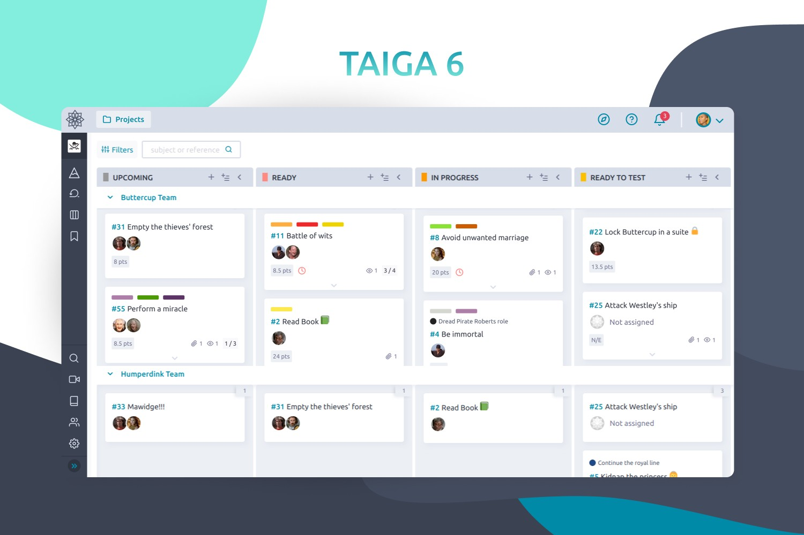

# Taiga CI/CD pipeline

Deploy Taiga server with CI/CD on Elestio

 
 

# Once deployed ...

You can can open Taiga Admin UI here:

    URL: https://[CI_CD_DOMAIN]
    email:[ADMIN_EMAIL]
    password: [APP_PASSWORD]
    
You can can open Taiga Super Admin UI here:

    URL: https://[CI_CD_DOMAIN]/admin
    user: admin
    password: [ADMIN_PASSWORD]
